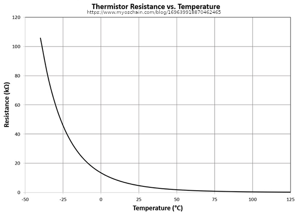

# IoT First individual assignment - Title - Salvatore FAVA

## The problem and IoT need
A henhouse è una costruzione fisica che consente l'allevamento di poultry galline allo scopo di produrre carni e uova. Oggigiorno, una struttura di piccole dimensioni (< 100 galline) ecosostenibile, prevede principalmente tre fattori:
- Il libero movimento di tali animali all'interno dello stabile, 
- L'impiego di luce solare per il riscaldamento
- L'introduzione di illuminazione artificiale per regolare il ciclo circadiano (ciclo sonno/veglia)

Per sfruttare al meglio le ore di luce, il tetto dello stabile comprende delle parti/zone in vetro per favorire l'ingresso di luce solare e calore. Unfortunately, nei periodi caldi la temperatura può raggiungere valori molto alti (> 24°C), mettendo in pericolo la vita degli animali. Per raffrescare e mantenere sicura la temperatura (13°C - 24°C), i proprietari impiegano dei ventilatori che forzano l'ingresso di aria fresca dall'esterno verso l'interno abbassando la temperatura. 

Per migliorare la qualità di vita degli animali e la loro produttività, poultry farmer impiegano un sistema di illuminazione artificiale a luce calda (< 3000 K) a bassa valore di illuminance (~ 1,5 lux). Nello specifico l'illuminazione viene attivata durante le ore notturne per mantenere such illuminance. 

To automate of the above scenario the IoT technologies fit very well, namely implementing set of sensors (temperature and brightness) and a set of actuators (colling fan, led lamp, alarm) in the following way. Seguendo il paradigma Sense-Think-Act, è possibile rilevare ad intervalli temporali fissati la temperatura tramite il relativo sensore, elaborare e valutare il valore rilevato ed azionare l'attuatore cooling fan, notificando l'accensione con una sirena. Allo stesso modo è possibile rilevare l'evento assenza di luce attraverso il sensore di luminosità, processare i valori rilevati ed azionere l'attuatore relè relativo all'impianto di illuminazione

## Assumptions
- Per riprodurre il cooling fan viene impiegato un ventilatore domestico a 220V azionato tramite relay module
- To simulate the lighting behaviour, a 220v bulb is used

### Sensors
1. Temperature sensor (Thermistor RS PRO 151-237) [RS Components Website](https://it.rs-online.com/web/p/termistori/0151237/).
    - A thermistor is an electronic component used to measure low-range room temperature. It is a special type of resistor, namely its resistance changes according to room temperature. The one (that is) deployed in this project is a NTC (Negative Temperature Coefficient) thermistor, i.e. the component resistance is inversely proportional to temperature
    - The following graph shows the qualitative behaviour of the thermistor 
    - Since temperature is the most critical factor to assure life within the poultry farm, **periodic** measurements (10 mins) are mandatory   
2. Brightness sensor (Photoresistor LDR Luna Optoelectronics NSL-19M51) [RS Components Website](https://it.rs-online.com/web/p/ldr-fotoresistenze/9146710/)
    - A photoresistor is an electronic component used to sense the brightness. It is also called LDR (Light Dependent Resistor) because the value of resistance changes according to the light, namely the higher the light is the lower the resistance is
    - The below graph describes qualitative behaviour of the photoresistor  

### Actuators
1. Relay Module with Optocoupler (8 Channels) - (https://www.elegoo.com/collections/electronic-component-kits/products/elegoo-8-channel-relay-module-kit?variant=32467576324144)
2. 

Pollaio per pulcini con tetto in vetro. Durante il giorno la luce del sole puo aumentare la temperatura oltre soglia(Sensore temperatura), allora intervengo con Rele->Ventilatore per abbasssare la temperauta a quella consentita. Durante la notte la luce solare non è più presente ma i pulcini hanno bisogno di stare al chiarore pertanto quando (Sensore luminosità basso) accende il secondo relè. 
fotoperiodo costante rende la produzione di uova costante,integrare il fotoperiodo di qualche ora è molto diverso dal tenere le galline 24 ore sotto illuminazione artificiale, avranno comunque la loro pausa durante la muta non vedo cosa ci sia di sbagliato
## Collected data

## Network architecture

## Fonti
https://en.wikipedia.org/wiki/International_System_of_Units
