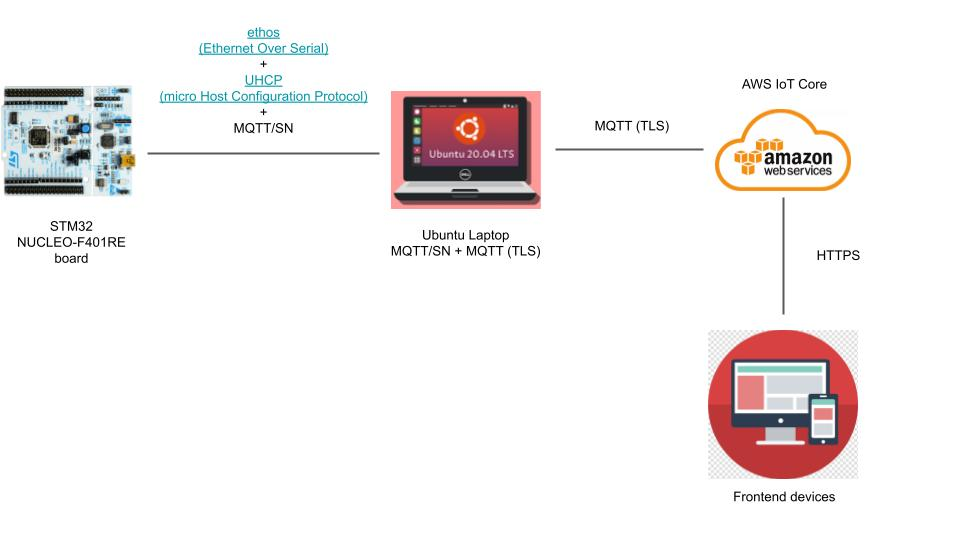
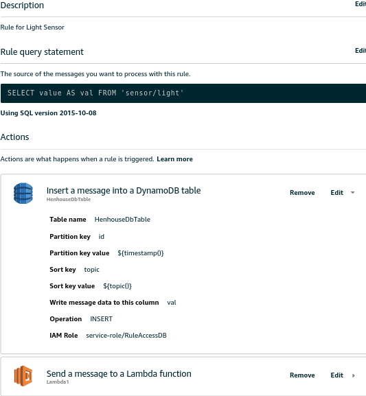
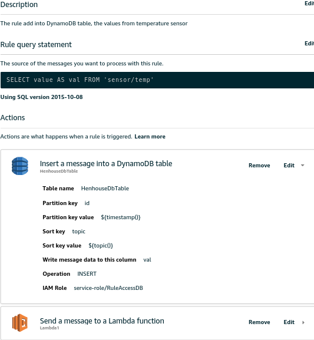
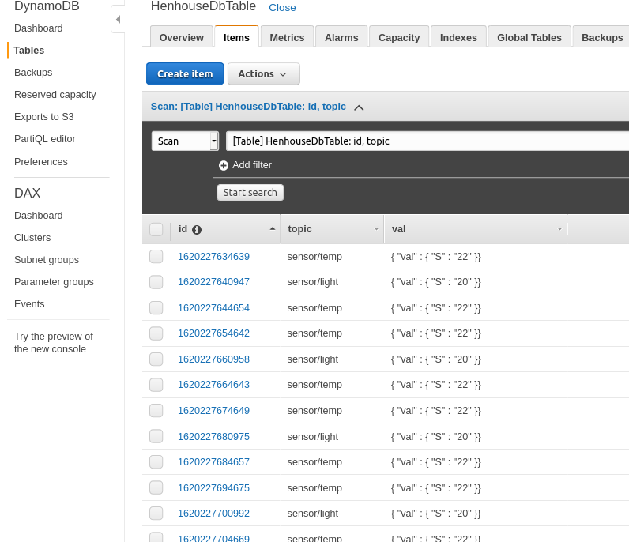

# IoT First individual assignment - Title - Salvatore FAVA

## What is the problem and why do you need IoT?
### The problem 
A hen house is a building where poultry is bred in order to produce meat and eggs. Nowadays a small eco-friendly structure (with fewer than 100 poultry) has to consider three main factors:
- the free movement of the animals inside the building;
- the use of solar light for the heating;
- the introduction of artificial lighting to regulate the circadian cycle (sleeping and waking cycle).

In order to make the most of the sunlight, the roof of the building consists of/includes some parts made of glass to let the solar light and the heat pass. Unfortunately, in hot periods the temperature can reach very high values( more than 24°C) that can be dangerous for the animals. To keep the temperature at safe levels (between 13°C and 24°C) the owners make use of fans that force the entrance of fresh air from the outside to the inside of the building, thus lowering the temperature.

To improve the quality of the animals’ life and their productivity, poultry farmers use a system of artificial lighting with hot light (less than 3000K) at a low value of illuminance (~1,5 lux). Specifically the illumination is activated at evening hours to keep that illuminance.

### IoT need
To automate the scenario above the IoT technologies fit very well, in particular with a set of sensors (temperature and brightness) and a set of actuators (cooling fans, led lamps, alarm/buzzer) used in the following way. Following the ‘Sense-Think-Act’ paradigm it is possible: 
    1. to measure the temperature at fixed intervals and with the pertinent sensor; 
    2. to elaborate the values previously taken 
    3. to switch the cooling fan actuator on, together with a siren to warn the farmer about high temperature. 
In the same way it is possible:
    1. to point out  the ‘Absence of light’ through the brightness sensor; 
    2. to process the values previously taken 
    3. to operate the lighting system actuator

### Assumptions
- A 220V domestic fan is used to reproduce the cooling fan through relay module.
- To simulate the lighting behaviour, a 220V bulb is used through relay module

## What data are collected and by which sensors?
### Sensors
1. Temperature sensor (Thermistor RS PRO 151-237) [RS Components Website](https://it.rs-online.com/web/p/termistori/0151237/)
    - A thermistor is an electronic component used to measure room temperature. It is a special type of resistor, in particular its resistance changes according to the room temperature. The thermistor employed in this project is a NTC (Negative Temperature Coefficient) one, i.e. the component resistance is inversely proportional to the temperature
    - The following graph shows the qualitative behaviour of the thermistor 
    - Since temperature is the most critical factor to assure life within the henhouse, **periodic** measurements (10 minute intervals) are mandatory   

2. Brightness sensor (Photoresistor LDR Luna Optoelectronics NSL-19M51) [RS Components Website](https://it.rs-online.com/web/p/ldr-fotoresistenze/9146710/)
    - A photoresistor is an electronic component used to sense brightness. It is also called LDR (Light Dependent Resistor) because the value of resistance changes according to the light, namely the higher the light is the lower the resistance is
    - The graph below describes qualitative behaviour of the photoresistor 
    - Brightness depends on day/night cycle and on weather conditions. 
    - The light factor is less critical than the temperature one, because poultry can still survive in the darkness, then a longer **periodic** sensing (30 minute intervals) is enough

### Collected data from Sensors
By the use of the above-mentioned temperature sensor,an analog signal relative to the real room temperature is produced with respect to the **datasheet** specifications:
|   Parameter   |    Value    |
| ------------- | ------------- |
| Temperature coefficient type  | NTC  |
| Resistance @ 25°C  | 10kΩ  |
| **Tolerance**  | 	**±0.9%**  |
| Max power  | 75mW  |
| Max operative temperature  | +150°C |
| Min operative temperature  | -80°C |

This sensor is wired connected to the [STM Nucleo](README.md/#STM32-Nucleo-64-development-board-&-RIOT-OS) board as in the picture below. 
**Data analysis first step** The board collects the analog signal every **10 minutes** and samples it using the internal 12-bit ADC (Analog-Digital Converter). Finally, the digital sample is converted in **°C** using the ``` adc_util_map() ``` function inside the ``` analog_util.h ``` offered by the RIOT OS.

By the use of the above-mentioned brightness sensor, an analog signal relative to the real room light is produced with respect to the **datasheet** specifications:
|   Parameter   |    Value    |
| ------------- | ------------- |
| Power Dissipation @ 25°C | 50 mW |
| Max Light Resistance | 100 kΩ  |
| Min Light Resistance | 20 kΩ  |
| Dark Resistance  | 20 MΩ  |
| Max operative temperature  | +75°C |
| Max operative temperature  | -60°C |

This sensor is wired connected to the STM Nucleo board as in the picture below. 
**Data analysis first step** The board collects the analog signal every **30 minutes** and samples it using the internal 12-bit ADC (Analog-Digital Converter). Finally, the digital sample is converted in **LUX** using the ``` adc_util_map() ``` function inside the ``` analog_util.h ``` offered by the RIOT OS.  


### Actuators
1. Active buzzer (Buzzer RS PRO 171-0898) [RS Components Website](https://it.rs-online.com/web/p/buzzer-magnetici/1710898/)
    - A buzzer, also named beeper, is an electronic devices used to emit a fixed sound whenever it is powered on. 
    - In details, this project involves an electromagnetic buzzer that lets out a constant tone (85 dB)
    - The actuator is wired connected to the [STM Nucleo](README.md/#STM32-Nucleo-64-development-board-&-RIOT-OS) board as in the picture below.
    - As described in [The problem and IoT need](README.md/#The-problem-and-IoT-need) section, the whole system makes use of the buzzer to acoustically inform the farmer about high temperature inside the poultry. Remember according the temperature sensor data, the buzzer is turned on or off.    
2. Relay Module with Optocoupler (8 Channels) [Elegoo Website](https://www.elegoo.com/collections/electronic-component-kits/products/elegoo-8-channel-relay-module-kit?variant=32467576324144)
    - The relay module is an electrically operated switch that allows you to turn on or off a circuit with a voltage and/or current that is much higher than a microcontroller could handle. 
    - There is no connection between the low voltage circuit operated by the microcontroller and the high power circuit. The relay protects each circuit from the other.
    - This actuator is wired connected to the [STM Nucleo](README.md/#STM32-Nucleo-64-development-board-and-RIOT-OS) board as in the picture below. First channel is devoted to the cooling fan and second channel to lamp.
    - As described in [The problem and IoT need](README.md/#The-problem-and-IoT-need) section, the relay is employed to separately activate both the cooling fan and the lamp. The former lowers the temperature whenever this one is above the threshold (24°C) while the latter keeps the illuminance constant (1.5 lux) whenever this one is below the threshold (<1.5 lux). Rememeber according to the processed temperature data the cooling fan is turned on or off and according to processed brigthness data the lamp is switched on or off. 

### STM32 Nucleo-64 development board and RIOT-OS
The core of the whole system is [STM NUCLEO-F401RE](https://www.st.com/en/evaluation-tools/nucleo-f401re.html) development board. It allows to build a prototype of the real system within an affordable all-in-one platform (ST-LINK debugger/programmer are included).

To develop the software needed to manage and process all the data of the infrastructure, the STM board relies on the **RIOT operating system**.
[RIOT](https://www.riot-os.org/)  is a free, open source operating system developed by a grassroots community gathering companies, academia, and hobbyists, distributed all around the world. RIOT supports most low-power IoT devices and microcontroller architectures (32-bit, 16-bit, 8-bit). RIOT aims to implement all relevant open standards supporting an Internet of Things that is connected, secure, durable & privacy-friendly.


## What are the connected components, the protocols to connect them and the overall IoT architecture?
### Network diagram (Physical devices and Protocols)
The following diagram depicts all the physical devices employed in this project and relative network protocols used to interconnect each other


In order to **clearly understand** how the physical devices and software components work together look at paragraph [Overall high-level architecture diagram of the whole system](README.md/#Overall-high-level-architecture-diagram-of-the-whole-system)

### Software components
Here there is a complete list of all software components underlying the above-mentioned hardware architecture, from left most devices to the bottom right devices.
* [RiotOS](README.md/#STM32-Nucleo-64-development-board-and-RIOT-OS)) runs inside the ST Nucleo board that executes a C application with a MQTT-SN client: [main.c](main.c)
    * The C application retrieves periodically data from the two sensors using two different threads, then deploys the 'think' phase of **sense-think-act** paradigm in two ways. First it encapsulates the data into MQTT JSON messages and sends them via MQTT-SN client [emCute](http://api.riot-os.org/group__net__emcute.html) to the RSMB MQTT-S broker. Second it performs comparison between the sampled data for light and temperature and the relative default thresholds. In the end, according to the results of the 'think' phase (the comparisons) it 'acts' enabling or disabling appropriate actuators (buzzer and cooling fan or lamp)
    * It is also important to notice the aplication is able to 'act' in an alternative fashion. It allows to enable or disable each actuator by receiving MQTT messages from the outside, i.e from the remote command of [Web dashboard](README.md/#Web-dashboard)  
    * Please, for a datailed description of the C application working and **how to setup the whole C application** you may refer to source code [main.c](main.c) 

* Ubuntu 20.04 LTS runs on top of a laptop, which acts as both MQTT-SN broker and MQTT broker with TLS
    * The former receives MQTT-SN messages from the MQTT-SN client [emCute](http://api.riot-os.org/group__net__emcute.html). 
In particular the former is [Mosquitto RSMB: Really Small Message Broker](https://github.com/eclipse/mosquitto.rsmb), an implementation of the MQTT and MQTT-SN protocols. The main reason for using RSMB over the main Mosquitto codebase is that Mosquitto doesn't currently have support for the MQTT-SN protocol. Unfortunately, **RSMB does not support TLS** for MQTT, which instead it is a mandatory requirement to connect to AWS IoT Core, so another software intermediary is needed **Eclipse Mosquitto broker**.
        * In this way, RSMB also acts as local bridge between itself and the Eclipse Mosquitto MQTT broker. For further information, it is strongly recommended to read the [RSMB configuration file](RSMB_config.conf)  
    * The latter is [Eclipse Mosquitto™](https://mosquitto.org/), an open source MQTT broker compliant with TLS. Pay attention it acts as **MQTT-SN/MQTT transparent bridge**, namely it subscribes to the default set of topics on MQTT-SN RSMB broker and forward all messages to AWS MQTT Broker, using certificate-based authentication (X509). 
        * For further information, it is strongly recommended to read the [Eclipse Mosquitto bridge file](EclipseMosquitto_config.conf). This file specifies the AWS IoT Core endpoint address, then which topics are bridged and in what fashion. The bottom of the file contains the specification to retrieve the Certificates for TLS authentication.

* [AWS web services](https://aws.amazon.com/?nc1=h_ls) by Amazon provides compute power, database storage, content delivery, cloud functionality to build sophisticated IoT applications with increased flexibility, scalability and reliability. In particulare the ones deployed inside the project are:
    * [AWS IoT Core](https://aws.amazon.com/iot/?nc1=h_ls). This one lets connected the IoT devices easily and securely interact with cloud applications as well as makes it easy to securely register, organize, monitor, and remotely manage IoT devices. **In detail** AWS IoT Core includes the MQTT broker that the above-mentioned Eclipse Mosquitto connects to. Therefore AWS MQTT broker receives MQTT JSON messages from Eclipse Mosquitto transparent bridges and acts according to the following [IoT Rule](https://docs.aws.amazon.com/iot/latest/developerguide/iot-rules.html). These rules give the IoT devices the ability to interact with AWS services, in particular they exploit an SQL-like syntax to query the received MQTT topic stream and then take desired actions.
        * Before you look at the two rules, it is fundamental to learn how these ones are created. A simple guide is provided by this [Youtbe Video](https://www.youtube.com/watch?v=JD16rVBUF-8). 
        * Rule01 - Insert the **light** value message into the HenhouseDbTable's DynamoDB table and perform a Lambda function: Lambda1.py (For a better explanation, you may refer to AWS Lambda section] below)
        
        * Rule02 - Insert the **temperature** value message into the HenhouseDbTable's DynamoDB table and perform a Lambda function: Lambda1.py (For a better explanation, you may refer to AWS Lambda section below)
        
        
    * [AWS DynamoDB](https://aws.amazon.com/dynamodb/) is a fast and flexible NoSQL database service for any scale. DynamoDB is used to store the MQTT message from the real above-mentioned sensors into a table, i.e. the *HenhouseDbTable*. The table consists of these fields: ```Id``` is the partition key that stores arrival timestamp for each entries, ```Topic``` is the sort key to save the mqtt topic and the ```Val``` is a string  to store the actual value (LUX or Celsius) from the sensor
        * In order to create the table and properly set it, you can follow the [official aws documentation](https://docs.aws.amazon.com/amazondynamodb/latest/developerguide/SampleData.CreateTables.html). It provides a ***simple step-by-step tutorial*** to build up the desired working table.   
        * The picture below is a sample of the table 
        

    * [AWS S3](https://aws.amazon.com/s3/) stands for Amazon Simple Storage Service and is an object storage service that offers industry-leading scalability, data availability, security, and performance.
        * In this project S3 acts as Web Hosting service to host 'static' website, i.e. the [Web dashboard](README.md/Web-dashboard).
        * Before you move on, it is mandatory to set up the AWS S3 environment to host a public-accessible web page using the official guide [Hosting a static website using Amazon S3](https://docs.aws.amazon.com/AmazonS3/latest/userguide/WebsiteHosting.html)
        * A deeper analysis of website's framework and how it is regenerated with updated values from the sensor is provided in the next two sections   

    * [AWS Lambda](https://aws.amazon.com/lambda/) is a serverless compute service that lets you run code without provisioning or managing servers, creating workload-aware cluster scaling logic, maintaining event integrations, or managing runtimes.
        * This project involves a Python Lambda function (see [Lambda1.py source code](AWS_Backend/Lambda.py)) that is triggered by the two above mentioned IoT Rules.
        * The goal of this function is to dinamically generate the [Web dashboard](README.md/Web-dashboard), in spite of the concept of dynamic web-page is not provided by AWS S3. Every time the lambda is triggered, overwrites a new html file (i.e. html web dashboard) in the S3 public bucket containing the latest value retrieved from the DynamoDB table in the last hour, the aggregated values (min, max, avg) and a set of buttons to enable/disable the actuator. 
        * The lambda function makes use of [Boto3](https://boto3.amazonaws.com/v1/documentation/api/latest/index.html), which is the AWS SDK for Python to create, configure, and manage AWS services (in this scenario DynamoDB and S3) 
        * Initially the lambda queries the DynamoDB table via the Boto3 using a dynamodb client. This retrieves all the values since last hour, then it processes the minimum, the maximum and the average value for the temperature and the light. After that it puts all these elements inside a string containing HTML framework of the web dashboard, eventually it generates and puts a new S3 object (its body is the string containg HTML code) inside the S3 bucket via a Boto3 S3 client.
        * The lambda function puts javascript code inside the HTML file, too. The script is used to remotely enable/disable the actuators.
        * It is foundamental to employ Amazon Cognito lets you add user sign-up, sign-in, and access control to your web and mobile apps quickly and easily  AWS SDK for JavaScript
    
* Web dashboard is an HTML/JS file hosted by an S3 bucket that provide the following functionalities:
    * Display latest values from the two sensors
    * Display aggregated values from the two senors (min, max, average)
    * Display last hour values from the two sensors
    * Provide 8 buttons to remote turn on/turn off each actuatur (i.e. alarm, cooling fan, lamp).
    * Link of the web dashboard is [http://henhouse-salvo.s3-website-us-east-1.amazonaws.com/](http://henhouse-salvo.s3-website-us-east-1.amazonaws.com/)  
    * [AWS Cognito](https://aws.amazon.com/cognito/)
    * [AWS SDK for JavaScript]

In order to clearly understand how the physical devices and software components work together look at paragraph [Overall high-level architecture diagram of the whole system](README.md/#Overall-high-level-architecture-diagram-of-the-whole-system)

### Overall high-level architecture diagram of the whole system

## Sources
* https://www.agraria.org/polli/ricoveri.htm
* https://www.poultryledlights.com/
* https://en.wikipedia.org/wiki/International_System_of_Units
