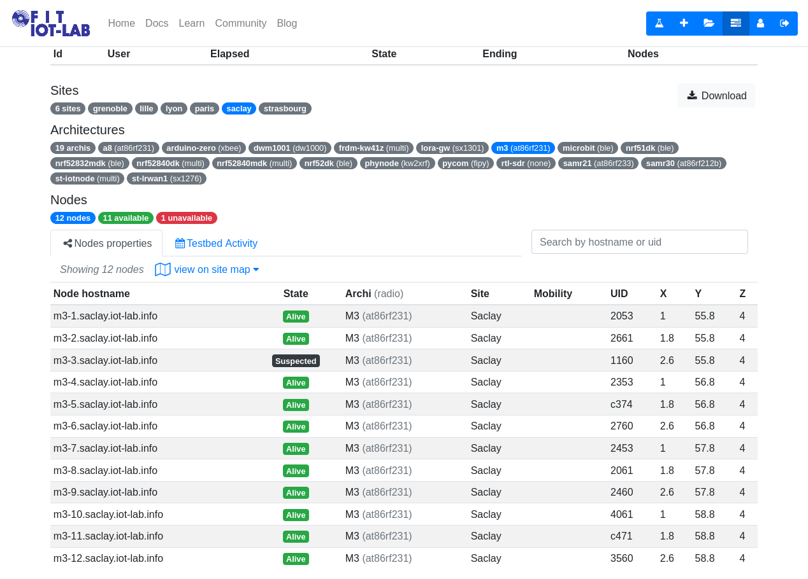
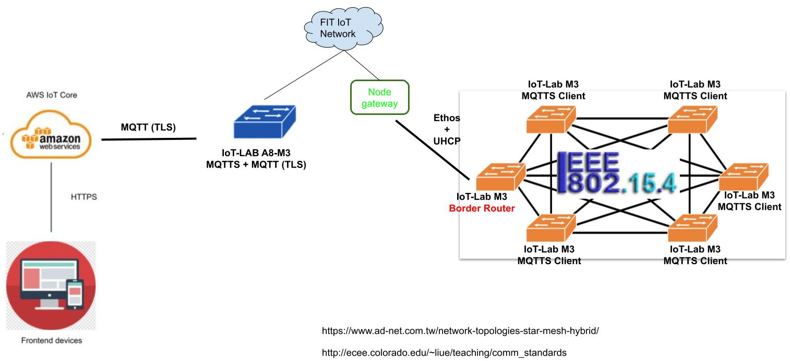
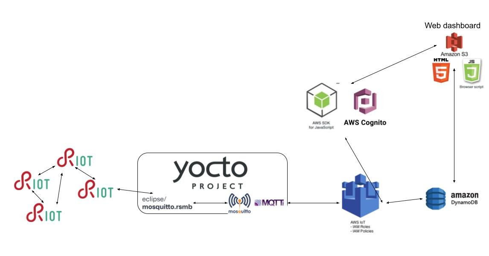

# IoT Second individual assignment
The goal of this assignment is to deploy a wireless sensor network, which consists of multiple MCUs, by using 802.15.4 mesh network technologies and 6LoWPAN  protocols, and meanwhile to evaluate the performance of the whole system. This time the system incorporates also the [first individual assignement](./../FirstAssignment) system, this means newer system is able to receive sensor values both from the **local** STM32 Nucleo F401RE and the **remote** wireless sensor network from FIT Iot-LAB

- For further information, please refer to http://ichatz.me/Site/InternetOfThings2021-Assignment2

## Premise
The whole wireless sensor network is implemented inside the [Saclay deployment](https://www.iot-lab.info/docs/deployment/saclay/) from FIT IoT-LAB for the following reasons:
1. Light sensors are above the floor. Despite [Grenoble site](https://www.iot-lab.info/docs/deployment/grenoble/) offers the biggest number of M3 nodes, i.e. 380 nodes, all sensors are located under an access floor, so completely in the dark. On this IoT-LAB site, the light sensors won't return usable values (always 0) for this experiment. Conversely, on Saclay site, the boards are located above the floor, therefore they provide useful LUX values.
2. Shorter waits to perform experiments. This individual assignment requires mainly [IoT-LAB M3](https://www.iot-lab.info/docs/boards/iot-lab-m3/) nodes and  Saclay site is quite often **free** with respect to the number of users which make use of this kind of board.
 
The following points address the new structure/diagram of the IoT system and its performance:

## How is the deployment of ***multiple sensors*** going to affect the IoT platform
Deploying multiple [IoT-LAB M3](https://www.iot-lab.info/docs/boards/iot-lab-m3/) boards, each one providing the **same** sensors (temperature and light) as the ones of the first individual assignment, sureley implies a bigger amount of data available. This aspect leads several advantages and disadvantages.
### Advantages of use multiple overlapping sensors
1. Data quality
   1. Temperature and light are [scalar physical quantities](https://en.wikipedia.org/wiki/Scalar_(physics)) (punctiform) therefore they change according to environmental position, namely with respect to the point in which the sensor performs measurement. 
   2. In particular employing 22 different sensors (11  for temperature and 11 for light, belonging to **different boards**) spread all over the building surface on Saclay site, allow to get values from different points of the environment. (Conversely the architecture of the previous assignment provide values from a single point only)
   3. This architecture allows to carry out the average temperature and brightness of the entire environment (not only physical quantity from a limited portion of the environment as in the previous assignment). 
   4. It is possible to get more accurate values for both quantites that are very very close to the real values
2. Fault tolerance
   1. Exploiting different boards, each one with its set of sensors, grants continuity and availability of temperature and light values even if a set of sensors/boards stops working or carries out abnormal data due to mulfunctioning. 
   2. For example, right now (17/06/2021 16:00) on Saclay site ```m3-3.saclay``` board is **unavailable/suspected**, as you can see from the picture below:  If the IoT system relies on that specific device then no data will be carried out, the web-dashboard will result always empty and the whole system will be useless. 
   3. Moreover the possibility to perform aggregated computations for a specific physical property, through data coming from different positions at the same time, protects against wrong measurement values.
      * In other words if you can trust the majority of the sensor values then even if there are few abnormal values, the outcome is still a reliable one (arithmetic mean).
3. Energy efficiency
   1. In accordance with the [network diagram](./README.md/###Network-diagram-(Physical-devices-and-Protocols)) of this assignment ```m3-1.saclay``` acts as Border router, namely allows to exchange (route) messages between the multihop wireless newtork and the world-wide network, while remaining nodes ```m3-1.saclay``` - ```m3-12.saclay``` are End point, namely produce data only and send it over the wireless sensor network. It is clear energy consumptions are pretty different according to the role of the node: 
   2. Border router routes, distributes/issues network parameters to End points, meanwhile produce data, therefore it requires the highest energy requirement
   3. End points, on the other hand, deal with sensing physical quantities sending over the network, therefore the lowest energy level is required 
### Disadvantages of a multi-hop wireless network
1. Throughput.
   1. As stated in the introduction of this section, deploying multiple boards entails deal with a bigger amount of data wrt first individual assignment
   2. Dealing with such an amount of information within a multi-hop wireless network, see [network diagram](./README.md/###Network-diagram-(Physical-devices-and-Protocols)), like the one in this system is less advantageous in term of number of exchanged packets per second. Since packets are forwarded from end point to border router through repeater nodes, then th number of packets per second is affected from each node performance. Poor intermediary node capabilities low the whole network throughput.  
2. End-to-End delay. The same as Throughput
3. Security
   1. Because of the need for intermediate nodes to forward packet toward its intended destination, every packet is vulnerable with respect to its intermediaries
   2. Indeed these nodes could perform whatever function/computation in the packet, altering its content, replace it entireley, or deviate it from the intended destination. 
   3. In order to avoid wrong behaviours as much as possible, different techniques (CRC, hash functions) should be undertaken

## What are the connected components, the protocols to connect them and the overall IoT architecture
### Network diagram (Physical devices and Protocols)
The following diagram depicts all the physical devices employed in this project and relative network protocols used to interconnect each other


**NOTE** First individual assignment's network components are neither depicted again in the diagram above nor these are not taken into account in the description below. (Look at the appropriate [document](/FirstAssignment/README.md/####-Network-diagram-(Physical-devices-and-Protocols)))

From RIGHT to LEFT:
1. All the available m3 boards on Saclay site, which act as follow:
   1. ```m3-1.saclay``` acts as Border router, using the example firmware as it is described at [RIOT gnrc_border_router](https://github.com/RIOT-OS/RIOT/tree/master/examples/gnrc_border_router). It makes use of both 802.15.4 network technologies and 6LowPAN to interact with endopoints/simple nodes, moreover like in the first assignment it uses ```ethos``` + ```UHCP``` to reach the IP network by FIT IoT-LAB
   2. ```m3-2.saclay``` - ```m3-11.saclay```board as end-points or single nodes. 
      1. They sense temperature and light as in the previous assignment with same sampling rate, but using the integrated sensors ***LPS331AP*** and ***ISL29020***
      2. Publish these values using MQTTS messages using 802.15.4 network interface within the 6LowPAN network.
      3. Hop-by-hop (node-by-node) MQTTS messages eventually reach the firs final destination: the Boarder router
2. IoT-LAB A8-M3, which behaves as the Ubuntu Laptop from the first assignment
   1. It is an MQTTS broker (RSMB) that receives insecure messages from the wireless mesh network, in turn bridged (transparent bridge) to the Eclipse Mosquitto MQTT Broker
   2. It is an MQTT broker (Ecliplse Mosquitto) that receive insecure messages from RSMB and forward them using TLS toward Amazon MQTT broker
3. AWS IoT Core, same as previous assignment
4. Frontend devices and WebDashboard that exchange message using HTTPS, same as previous assignment
 
In order to clearly understand how the physical devices and software components work together look at paragraph Overall high-level architecture diagram of the whole system

### Overall high-level architecture diagram of Software components
This section shows interdependencies among the different software components. While the same paragraph of the first assingment provides a detailed description of each single software, here only new components are described 

1. Nucleo firmware updated for include device id alongside the MQTTS messages
2. M3 boards which act as end-points run a new firmware version provided [here](). Several lines of code are comment ones which describe the behaviour of the whole firmware. 

Although the current repository provide keys and certificates to access my Amazon AWS account at [Firmware/MqttBrokerBridge](Firmware/MqttBrokerBridge) folder, these are currently not allowed from my personal account. If you want to try the whole system function, please contact me to allow your access at Amazon AWS.

In this assignment I prefer having two different separated firmware for simple node, namely one for FIT IoT-LAB M3 boards and one for NUCLEO F401RE board beacause:
1. they implement two different physical pin configurations for sensors and actuators, in particular components from the first assignment make use of analog input interface and gpio, conversely boards of the second assignment make use of drivers to connect to the desired sensors
2. different network parameters (different mqtts broker port and address), moreover different networks technology and topology (usb ethos vs. wireless sensor network)

## How do you measure the performance of the system
Each of the following points measure the performance of the whole IoT system in term of Network performance and Energy efficiency as the number of wireless node increase and their physical locations vary. 
### 5 wireless nodes as in series network topology 
#### Network performance

#### Energy consumption

### 5 wireless nodes as mesh network topology 
#### Network performance

#### Energy consumption

### 10 wireless nodes as in-series network topology 
#### Network performance

#### Energy consumption

### 10 wireless nodes as mesh network topology
#### Network performance

#### Energy consumption

### Conclusion


