# IoT Second individual assignment
The goal of this assignment is to deploy a wireless sensor network, which consists of multiple MCUs, by using 802.15.4 mesh network technologies and 6LoWPAN  protocols, and meanwhile to evaluate the performance of the whole system. This time the system incorporates also the [first individual assignment](./../FirstAssignment) system, this means newer system is able to receive sensor values both from the **local** STM32 Nucleo F401RE and the **remote** wireless sensor network from FIT Iot-LAB

- For further information, please refer to http://ichatz.me/Site/InternetOfThings2021-Assignment2

## Premise
The whole wireless sensor network is implemented inside the [Saclay deployment](https://www.iot-lab.info/docs/deployment/saclay/) from FIT IoT-LAB for the following reasons:
1. Light sensors are above the floor. Despite [Grenoble site](https://www.iot-lab.info/docs/deployment/grenoble/) offers the biggest number of M3 nodes, i.e. 380 nodes, all sensors are located under an access floor, so completely in the dark. On this IoT-LAB site, the light sensors won't return usable values (always 0) for this experiment. Conversely, on Saclay site, the boards are located above the floor, therefore they provide useful LUX values.
2. Shorter waits to perform experiments. This individual assignment requires mainly [IoT-LAB M3](https://www.iot-lab.info/docs/boards/iot-lab-m3/) nodes and  Saclay site is quite often **free** with respect to the number of users which make use of this kind of board.
 
The following points address the new structure/diagram of the IoT system and its performance:

## How is the deployment of ***multiple sensors*** going to affect the IoT platform
Deploying multiple [IoT-LAB M3](https://www.iot-lab.info/docs/boards/iot-lab-m3/) boards, each one providing the **same** sensors (temperature and light) as the ones of the first individual assignment, surely implies a bigger amount of data available to be handled. This aspect leads several advantages and disadvantages.
### Advantages of use multiple overlapping sensors
1. Data quality
   1. Temperature and light are [scalar physical quantities](https://en.wikipedia.org/wiki/Scalar_(physics)) (punctiform) therefore they change according to environmental position, namely with respect to the point in which the sensor performs measurement. 
   2. In particular employing 22 different sensors (11  for temperature and 11 for light, belonging to **different boards**) spread all over the building surface on Saclay site, allow to get values from different points of the environment. (Conversely the architecture of the previous assignment provides values from a single point only)
   3. This architecture allows to carry out the average temperature and brightness of the entire environment (not only physical quantity from a limited portion of the environment as in the previous assignment). 
   4. In this way, it is possible to get more accurate values for both quantities that are very very close to the real values
2. Fault tolerance
   1. Exploiting different boards, each one with its set of sensors, grants continuity and availability of temperature and light values even if a set of sensors/boards stops working or carries out abnormal data due to malfunctioning. 
   2. For example, right now (17/06/2021 16:00) on Saclay site ```m3-3.saclay``` board is **unavailable/suspected**, as you can see from the picture below:  If the IoT system relies on that specific device then no data will be carried out, the web-dashboard will result always empty and the whole system will be useless. 
   3. Moreover the possibility to perform aggregated computations for a specific physical property, through data coming from different positions at the same time, protects against wrong measurement values.
      * In other words if you can trust the majority of the sensor values then even if there are few abnormal values, the outcome is still a reliable one (arithmetic mean).
3. Energy efficiency
   1. In accordance with the [network diagram](./README.md/###Network-diagram-(Physical-devices-and-Protocols)) of this assignment ```m3-1.saclay``` acts as Border router, namely allows to exchange (route) messages between the multi-hop wireless network and the world-wide network, while remaining nodes ```m3-1.saclay``` - ```m3-12.saclay``` are End points, namely produce data only and send it over the wireless sensor network. It is clear energy consumption is pretty different according to the role of the node: 
      * Border router routes, distributes/issues network parameters to End points, meanwhile produce data, therefore it requires the highest energy requirement
      * End points, on the other hand, deal with sensing physical quantities sending over the network, therefore the lowest energy level is required 
### Disadvantages of a multi-hop wireless network
1. Throughput.
   1. As stated in the introduction of this section, deploying multiple boards entails deal with a bigger amount of data wrt first individual assignment
   2. Dealing with such an amount of information within a multi-hop wireless network, see [network diagram](./README.md/###Network-diagram-(Physical-devices-and-Protocols)), like the one in this system is less advantageous in term of number of exchanged packets per second. Since packets are forwarded from end point to border router through repeater nodes, then the number of packets per second is affected from each node performance. Poor intermediary node capabilities could low the whole network throughput, as well as, the End-to-End delay
2. Security
   1. Because of the need for intermediate nodes to forward packet toward its intended destination, every packet is vulnerable with respect to its intermediaries
   2. Indeed these nodes could perform whatever function/computation in the packet, altering its content, replacing it entirely, or deviating it from the intended destination. 
   3. In order to avoid wrong behaviors as much as possible, different techniques (CRC, hash functions) should be undertaken

## What are the connected components, the protocols to connect them and the overall IoT architecture
### Network diagram (Physical devices and Protocols)
The following diagram depicts all the physical devices employed in this project and relative network protocols used to interconnect each other


**NOTE** First individual assignment's network components are neither depicted again in the diagram above nor these are taken into account in the description below. (Look at the appropriate [document](/FirstAssignment/README.md/####-Network-diagram-(Physical-devices-and-Protocols)))

From RIGHT to LEFT:
1. All the available m3 boards on Saclay site, which act as follow:
   1. ```m3-1.saclay``` acts as Border router namely it makes use of both 802.15.4 network technologies and 6LowPAN to interact with endpoints/simple nodes. Moreover like in the first assignment it uses an attached device/computer (in this case a mini-computer called Gateway (GW)) through ```ethos``` + ```UHCP``` to reach the IP network by FIT IoT-LAB. In fact as reported at [FIT IoT-LAB - Testbed Design](https://www.iot-lab.info/docs/getting-started/design/) each experimentation board called Open Node (ON) is integrated with a mini-computer called Gateway (GW), which in turn provide tools to evaluate BOARD performance and give access to the FIT IoT-LAB network.
   2. ```m3-2.saclay``` - ```m3-11.saclay```board as end-points or single nodes. 
      1. They sense temperature and light as in the previous assignment with same sampling rate, but using the integrated sensors ***LPS331AP*** and ***ISL29020*** Both the [IoT-LAB M3 web-page](https://www.iot-lab.info/docs/boards/iot-lab-m3/) and this [Official Jupyter Notebook](https://github.com/iot-lab/iot-lab-training/tree/master/riot/basics/sensors)) by FIT Iot-LAB provide detailed information about these two sensors and how to use them in [RIOT-OS](www.riot-os.org)
      2. Publish these values using MQTTS messages using 802.15.4 network interface within the 6LowPAN network.
      3. Hop-by-hop (node-by-node) MQTTS messages eventually reach first final destination: the Border router
2. [IoT-LAB A8-M3](https://www.iot-lab.info/docs/boards/iot-lab-a8-m3/), which behaves as the Ubuntu Laptop from the first assignment
   1. It is an MQTTS broker (RSMB) that receives insecure messages from the wireless mesh network endpoints, in turn bridged (transparent bridge) to the Eclipse Mosquitto MQTT Broker
   2. It is an MQTT broker (Eclipse Mosquitto) that receive insecure messages from RSMB and forward them using TLS toward Amazon MQTT broker
3. Amazon AWS MQTT broker, same as previous assignment, which exchange MQTT(TLS) messages with the above-mentioned [IoT-LAB A8-M3](https://www.iot-lab.info/docs/boards/iot-lab-a8-m3/)
4. Frontend devices and Web-dashboard that exchange requests and responses using HTTPS, same as previous assignment
 
In order to clearly understand how the physical devices and software components work together look at paragraph Overall high-level architecture diagram of the whole system

### Overall high-level architecture diagram of Software components
This section shows inter-dependencies among the different software components. While the same paragraph of the first assignment provides a detailed description of each single software, here only new components are described 

1. A new RIOT firmware ```Henhouse_4.elf``` provided [here main.c](./Firmware/SimpleNode/iotlab-m3/main.c) for [IoT-LAB M3](https://www.iot-lab.info/docs/boards/iot-lab-m3/) boards which allow them to act as end-points. Several lines of code are comment ones which describe the behavior of the whole firmware, please look at it before you go on. 
   * Conversely, the local Nucleo F401RE board of the previous assignment still run the same firmware, sensing local environment and publishing MQTT messages just like before. As it is stated before, this board is still present in this assignment although this document does not take into account it.
   * **NOTE** In this assignment I prefer having two different firmwares for FIT IoT-LAB M3 boards and one for NUCLEO F401RE board because:
      * They implement two different physical pin configurations for sensors and actuators, in particular components from the first assignment make use of analog input interface and GPIO, conversely boards of the second assignment make use of drivers to connect to the desired sensors
      * They rely on different network parameters (different local mqtts broker port and address), moreover different networks technology and topology
2. The example firmware ```RIOT gnrc_border_router``` as it is described at [Official RIOT-OS GitHub repository](https://github.com/RIOT-OS/RIOT/tree/master/examples/gnrc_border_router), runs on top of the above-mentioned ```m3-1.saclay``` Border router
   * One change with respect to the official tutorial concerns how to build the offcial source code: ```make ETHOS_BAUDRATE=500000 BOARD=iotlab-m3 ```. That value of baudrate comes from the intrinsic UART baudrate of M3 with which the board reaches the IP Network by IoT-LAB.

3. Yocto OS + Eclipse RSMB + Eclipse Mosquitto run on top of [IoT-LAB A8-M3](https://www.iot-lab.info/docs/boards/iot-lab-a8-m3/) board, like in the previous asignment
   * **NOTE** Yocto OS replace Ubuntu 20.04 of the first assignment, but behaves just like before. The [Yocto Project](https://www.iot-lab.info/docs/os/yocto/) is an open-source project which allows the creation of embedded Linux distributions. The project was announced by the Linux Foundation in 2010 and launched in March, 2011, in collaboration with 22 organizations. 
4. AWS Webservices
   1. AWS IoT Core adds a new Thing ```FITIoT-Lab```, which grants access to AWS IoT Core webservices using a new dedicated set of keys and certificates. 
      * To allow the local nucleo board and m3 boards access AWS IoT core at the same time, two different set of keys and certificates are rquired (One for each Thing)
      * Although current repository provides keys and certificates to access my Amazon AWS account at [Firmware/MqttBrokerBridge](./Firmware/MqttBrokerBridge) folder, these are currently not allowed from my personal account. If you want to try the whole system functioning, please contact me at ***Salvo.f96@gmail.com*** 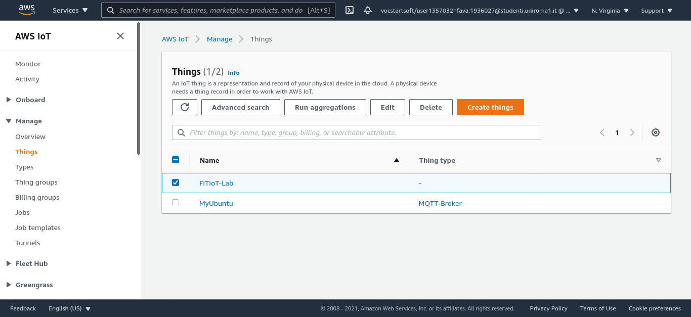
      
      * IoT Rules (Temperature and Light rule) are the same as before
   4. AWS DynamoDB the same as before
   5. AWS S3 hosts a new version of web-dashboard ```index2.html```, more additional details about its source code are provided below 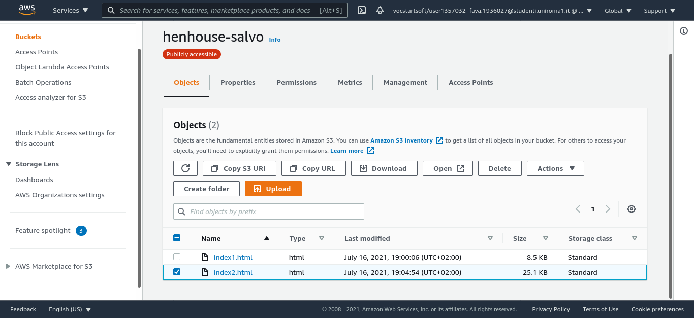
5.  Web-dashboard is a newer version which works with HTML5 and JS
   * It relies on [AWS JS SDK](https://docs.aws.amazon.com/AWSJavaScriptSDK/latest/) only (more efficient than previous version with Lambda)! 
   * Using this SDK the dashboard make use of Amazon Cognito (as in the previous assignment) in order to access/authenticate AWS Webservices 
   * Using this SDK the dashboard interacts with DynamoDB, to retrieve temperature and light values
   * Using this SDK the dashboard to send MQTT message to Amazon AWS broker to interact with specifid actuaturs and devices
   * All the aggreagted computation (avg, min, max) are performed on the client side using JS functions
   * Further information about the source code are available at [index2.html](./Frontend/index2.html) 
   * The following screenshot shows the current version of the Dashboard 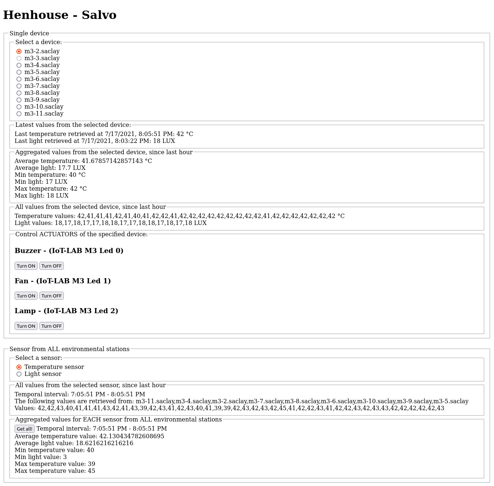  

## How do you measure the performance of the system
Each of the following points measure the performance of the whole IoT system in term of Energy efficiency (Power/Current/Voltage monitoring) and Wireless channel analysis, as the number of wireless node increase and consequently their physical locations vary. 
1. Power monitoring follows the official [Consumption monitoring guidelines](https://www.iot-lab.info/docs/tools/consumption-monitoring/) by FIT IoT-LAB, , please look at it to set up monitoring activity 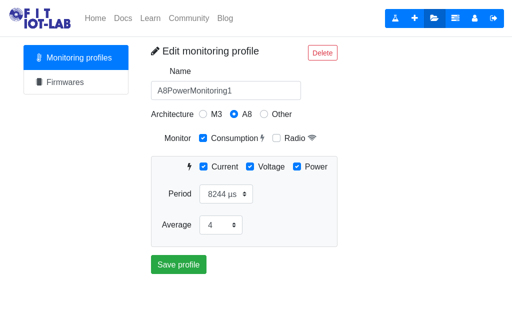
3. Wireless channel analysis follows the official [Radio monitoring guidelines](https://www.iot-lab.info/docs/tools/radio-monitoring/) by FIT IoT-LAB, please look at it to set up monitoring activity 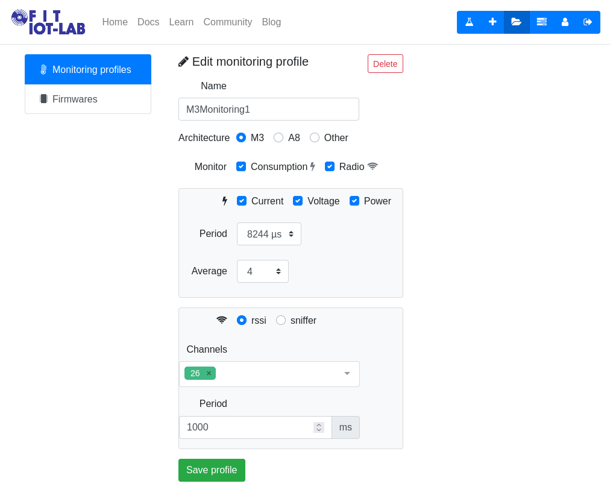
4. Here there is the list used to set up profiles above  (they take place at fava@saclay):
   1. ```iotlab-profile adda8 -n A8PowerMonitoring1 --power dc -voltage -current -power -period 8244 -avg 4```
   2. ```iotlab-profile addm3 -n M3Monitoring1 --power dc -voltage -current -power -period 8244 -avg 4 -rssi -channels 22 26 -num 1 -rperiod 1000```
5. Power monitoring concerns both A8 node and M3 nodes, while Wireless channel analysis concerns M3 boards only since they are the only one using 802.15.4 wireless technology
6. For each experiment, wireless channel employed is the **26** one for every m3 board (Multi-hop wireless network) and it is GRAPHICALLY evaluated only at Border router because all the wireless devices make use of the same channel.. Textual results are available at [Evaluation folder](./Evaluation) of this repository, and they include channel analysis for endpoints.
7.Next sections carry out graphical outcomes about the monitoring activities, for each node. 

### Experiment 272564 - 5 wireless nodes 
The IoT-LAB experiment 272564 takes place in Saclay site, involving:
* **5** endpoint nodes ```m3-2.saclay```, ```m3-4.saclay``` **-** ```m3-7.saclay``` 
* 1 border router ```m3-1.saclay```
* 1 MQTT bridge ```a8-2.saclay```

To show the following result, the following shell command are used:
1. ```iotlab-experiment submit -n Henhouse -d 120 -l saclay,a8,2 -l saclay,m3,1+2+4-7```
2. ```iotlab-node --profile A8PowerMonitoring1 -l saclay,a8,2```
3. ```iotlab-node --profile M3Monitoring1 -l saclay,m3,1+2+4-7```
4. ```plot_oml_consum --input ~/.iot-lab/272563/consumption/a8_2.oml --power --label "A8-2 - Power consumption analysis - Exp ID 272563"``` 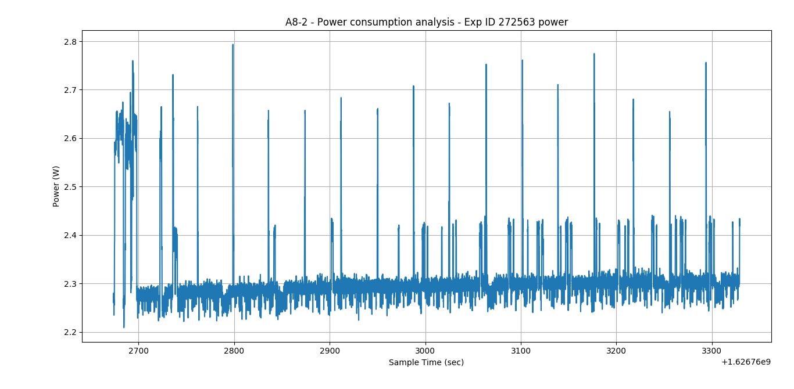
5. ```plot_oml_consum --input ~/.iot-lab/272563/consumption/m3_1.oml --power --label "Border router (m3-1) - Power consumption analysis - Exp ID 272563"``` 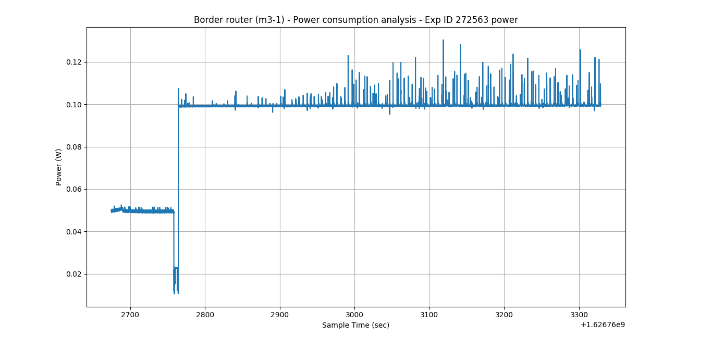
6. ```plot_oml_radio --input ~/.iot-lab/272563/radio/m3_1.oml --label "Border router (m3-1) - Wireless channel analysis - Exp ID 272563" --all``` 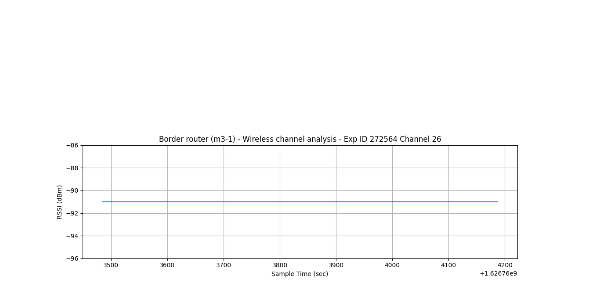
7. ```plot_oml_consum --input ~/.iot-lab/272563/consumption/m3_2.oml --power --label "Endpoint (m3-2) - Power consumption analysis - Exp ID 272563"``` 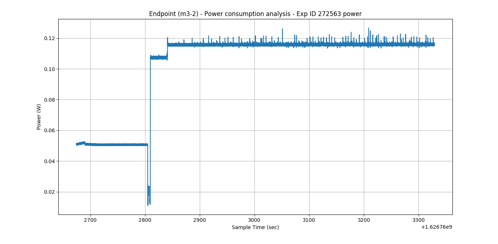
8. ```plot_oml_consum --input ~/.iot-lab/272563/consumption/m3_4.oml --power --label "Endpoint (m3-4) - Power consumption analysis - Exp ID 272563"``` 
9. ```plot_oml_consum --input ~/.iot-lab/272563/consumption/m3_5.oml --power --label "Endpoint (m3-5) - Power consumption analysis - Exp ID 272563"```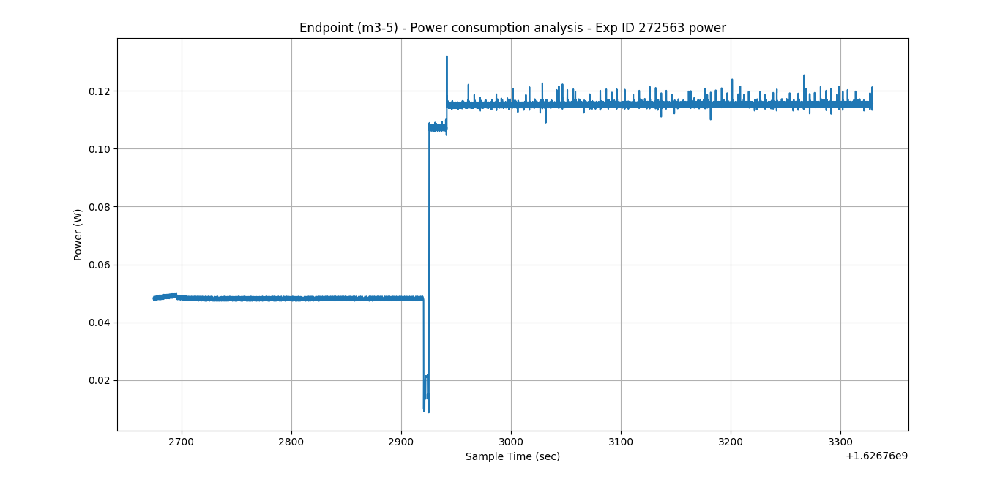
10. ```plot_oml_consum --input ~/.iot-lab/272563/consumption/m3_6.oml --power --label "Endpoint (m3-6) - Power consumption analysis - Exp ID 272563"```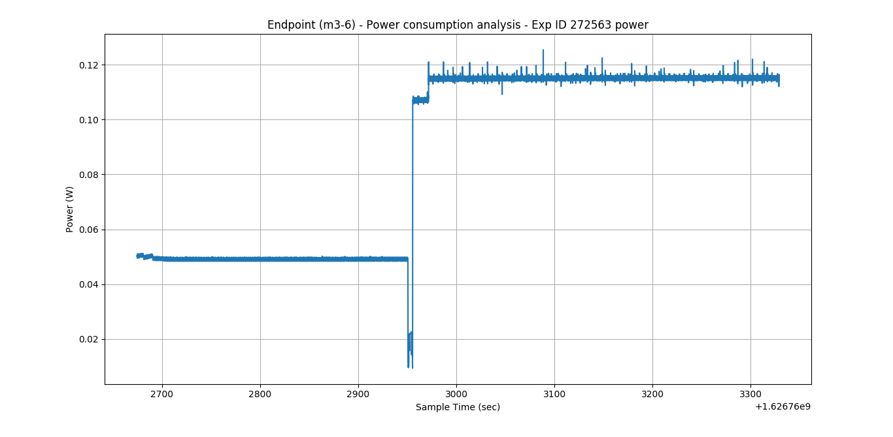
11. ```plot_oml_consum --input ~/.iot-lab/272563/consumption/m3_7.oml --power --label "Endpoint (m3-7) - Power consumption analysis - Exp ID 272563"```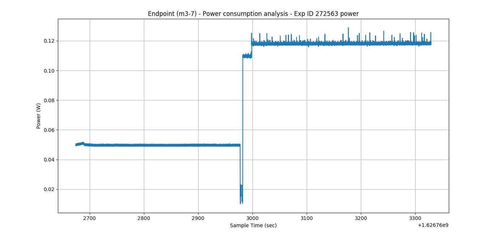

### 10 wireless nodes
The IoT-LAB experiment 272564 takes place in Saclay site, involving:
* **10** endpoint nodes ```m3-2.saclay```, ```m3-4.saclay``` **-** ```m3-12.saclay``` 
* 1 border router ```m3-1.saclay```
* 1 MQTT bridge ```a8-2.saclay```

To show the following result the following shell command are used:
1. ```iotlab-experiment submit -n Henhouse -d 120 -l saclay,a8,2 -l saclay,m3,1+2+4-12```
2. ```iotlab-node --profile A8PowerMonitoring1 -l saclay,a8,2```
3. ```iotlab-node --profile M3Monitoring1 -l saclay,m3,1+2+4-12```
4. ```plot_oml_consum --input ~/.iot-lab/272564/consumption/a8_2.oml --power --label "A8-2 - Power consumption analysis - Exp ID 272564"``` 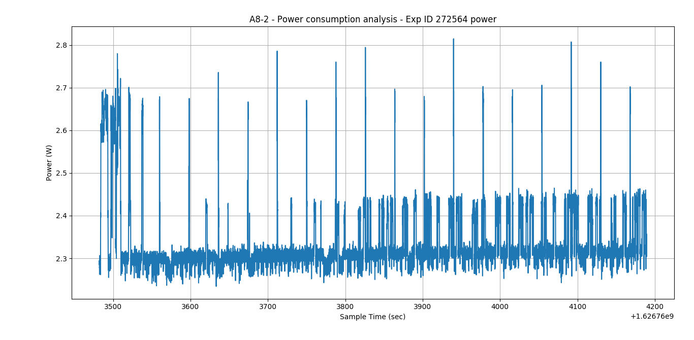
5. ```plot_oml_consum --input ~/.iot-lab/272564/consumption/m3_1.oml --power --label "Border router (m3-1) - Power consumption analysis - Exp ID 272564"``` 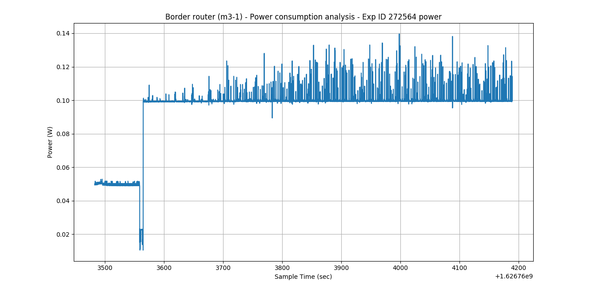
6. ```plot_oml_radio --input ~/.iot-lab/272564/radio/m3_1.oml --label "Border router (m3-1) - Wireless channel analysis - Exp ID 272564" --all``` 
7. ```plot_oml_consum --input ~/.iot-lab/272564/consumption/m3_2.oml --power --label "Endpoint (m3-2) - Power consumption analysis - Exp ID 272564"``` 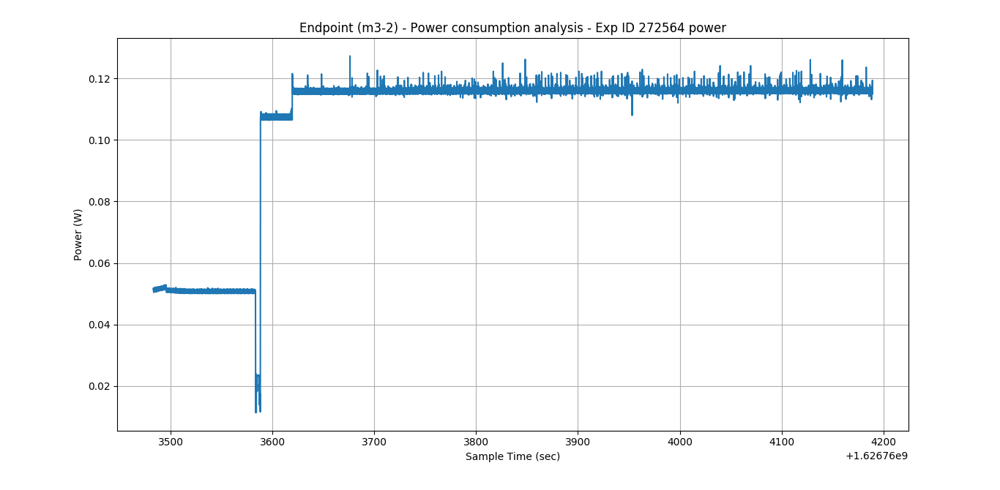
8. ```plot_oml_consum --input ~/.iot-lab/272564/consumption/m3_4.oml --power --label "Endpoint (m3-4) - Power consumption analysis - Exp ID 272564"``` 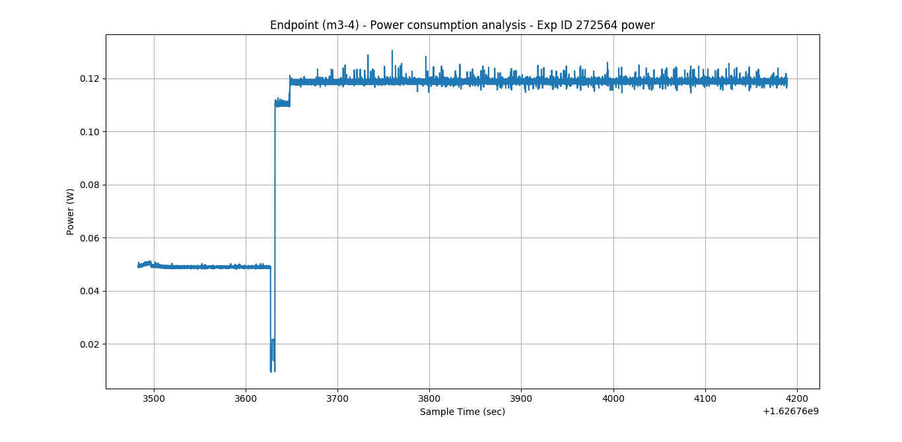
9. ```plot_oml_consum --input ~/.iot-lab/272564/consumption/m3_5.oml --power --label "Endpoint (m3-5) - Power consumption analysis - Exp ID 272564"```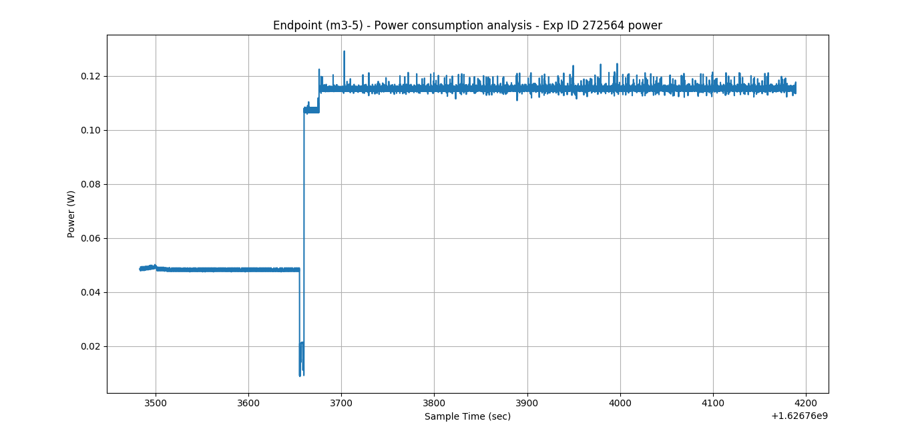
10. ```plot_oml_consum --input ~/.iot-lab/272564/consumption/m3_6.oml --power --label "Endpoint (m3-6) - Power consumption analysis - Exp ID 272564"```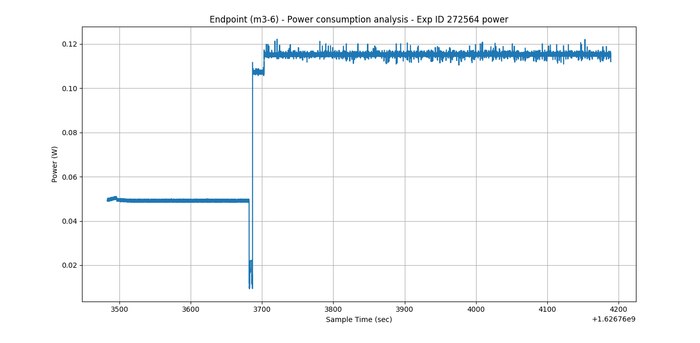
11. ```plot_oml_consum --input ~/.iot-lab/272564/consumption/m3_7.oml --power --label "Endpoint (m3-7) - Power consumption analysis - Exp ID 272564"```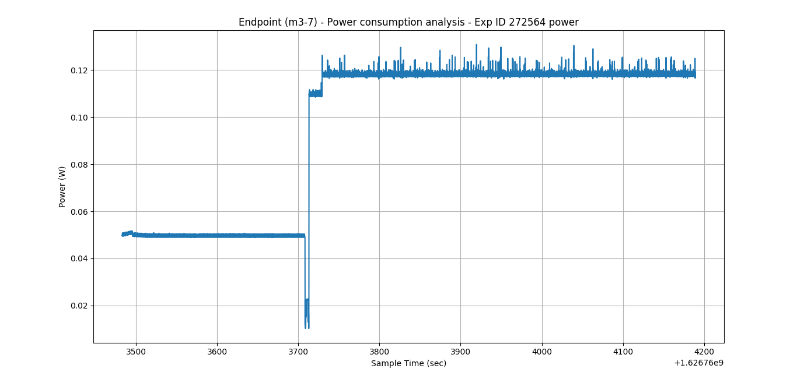
12. ```plot_oml_consum --input ~/.iot-lab/272564/consumption/m3_8.oml --power --label "Endpoint (m3-8) - Power consumption analysis - Exp ID 272564"```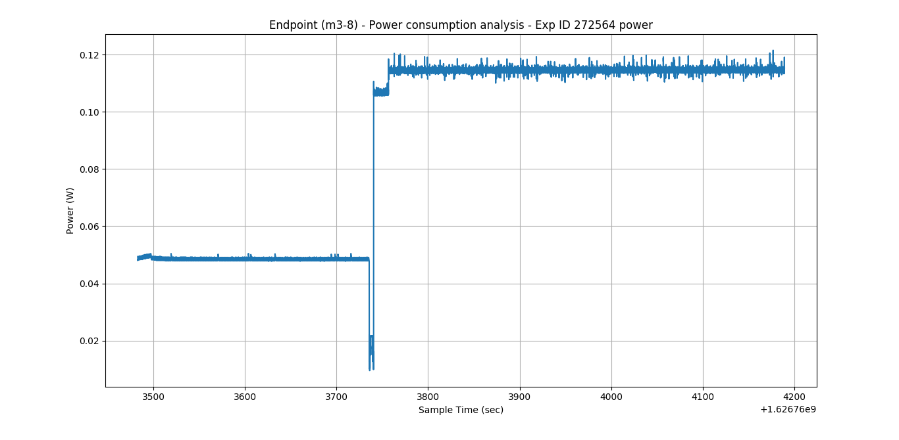
13. ```plot_oml_consum --input ~/.iot-lab/272564/consumption/m3_9.oml --power --label "Endpoint (m3-9) - Power consumption analysis - Exp ID 272564"```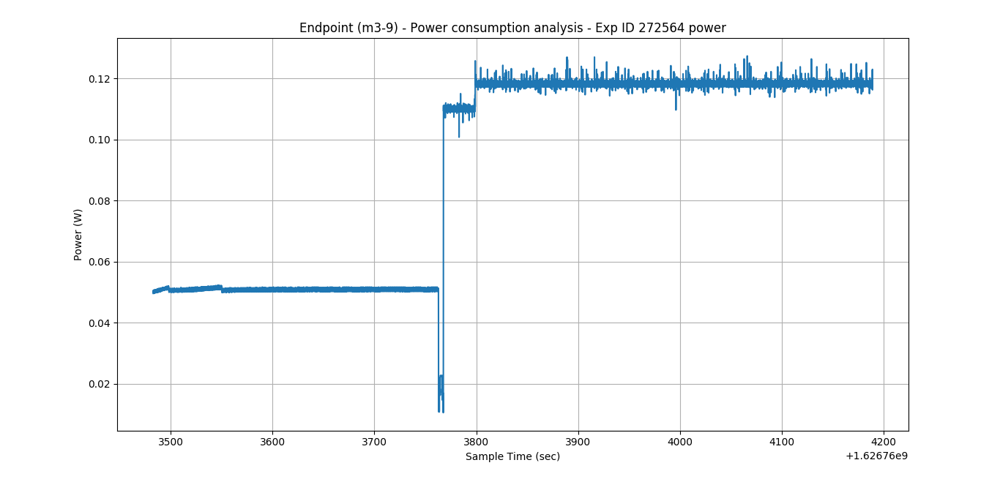
14. ```plot_oml_consum --input ~/.iot-lab/272564/consumption/m3_10.oml --power --label "Endpoint (m3-10) - Power consumption analysis - Exp ID 272564"```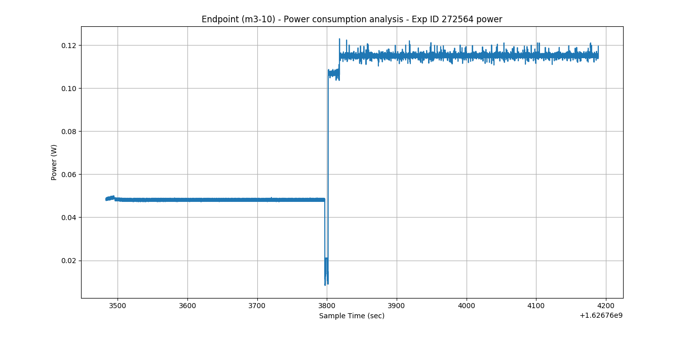
15. ```plot_oml_consum --input ~/.iot-lab/272564/consumption/m3_11.oml --power --label "Endpoint (m3-11) - Power consumption analysis - Exp ID 272564"```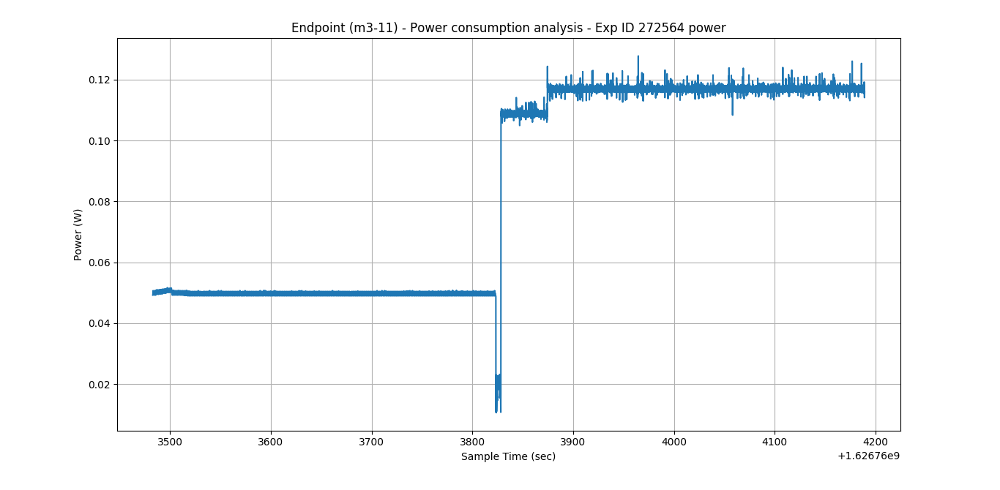
16. ```plot_oml_consum --input ~/.iot-lab/272564/consumption/m3_12.oml --power --label "Endpoint (m3-12) - Power consumption analysis - Exp ID 272564"```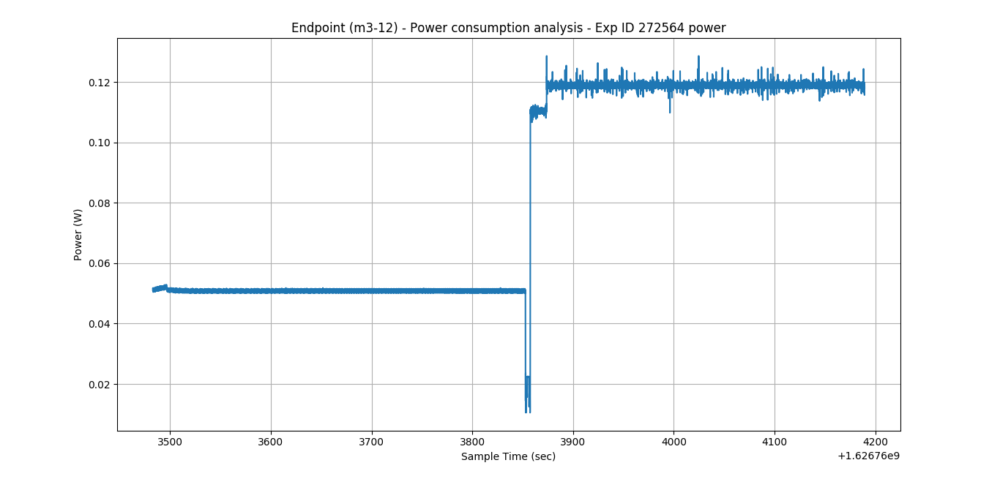

### Conclusion
1. As you can infer from the graphs above as the number of wireless nodes increases ```m3-1.saclay``` border router's power consumption increases. In particular, its first power consumption graph (m3-1.saclay) shows few peaks around 0.12 W with an average value of 0.11 W, conversely the second one shows much more peaks around 0.14 W and an average values of 0.12 W.
2. Since during both experiments there were not running experiments on Saclay site, border router's wireless channel analysis shows an RSSI near -91 dBm without noise. This means transceiver were able to exchange data without external noise in that frequency band (channel 26). Nevertheless depending on the radio environment perturbations, you could measure worse RSSI values with relative noise, that will damage wireless links.
3. As stated in the [Disadvantages of a multi-hop wireless network](./README.md#disadvantages-of-a-multi-hop-wireless-network) above, deploying multiple IoT-LAB M3 boards, surely implies a bigger amount of data available to be handled. It is absolutely clear looking at both the graphs of MQTTS/MQTT broker ```a8-2.saclay```, they show an harder power consumption activity that grows as the number of MQTTS message grows (second experiment)
