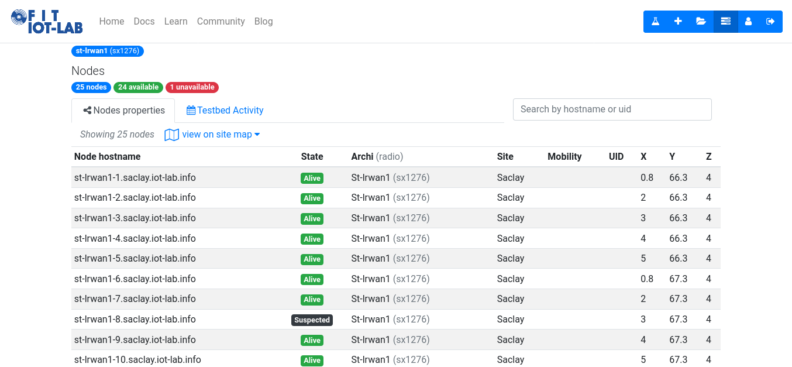
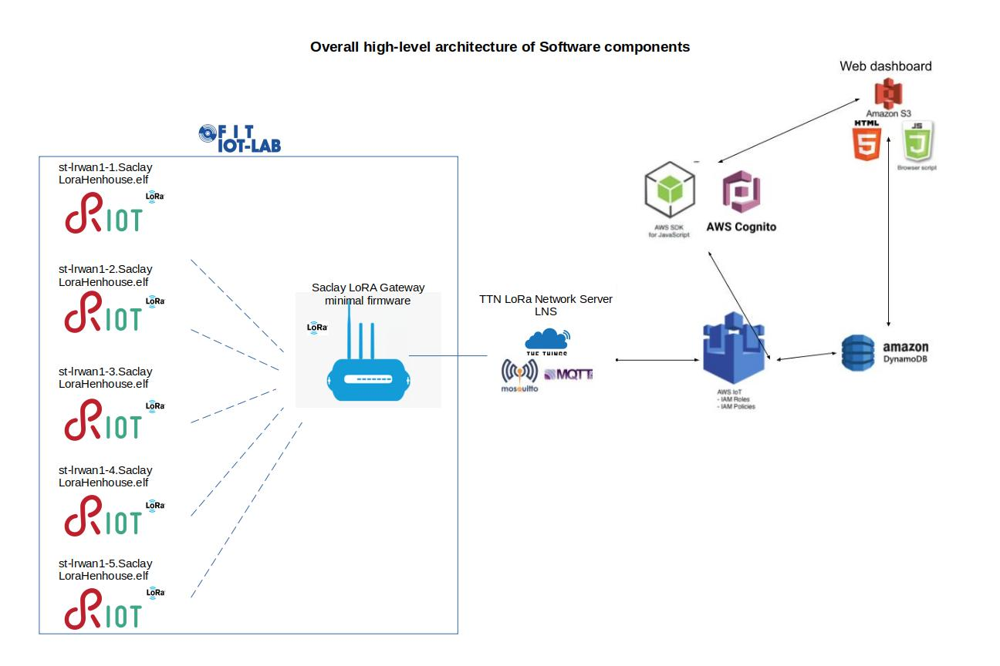
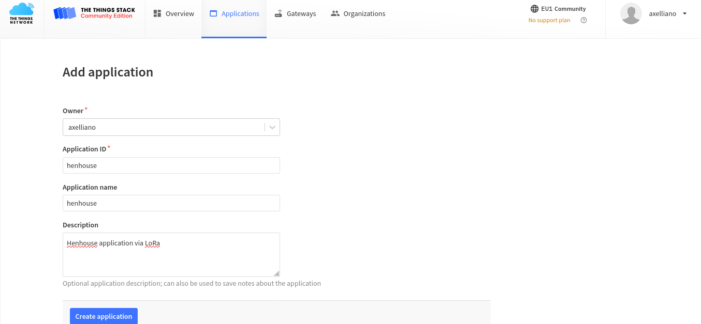
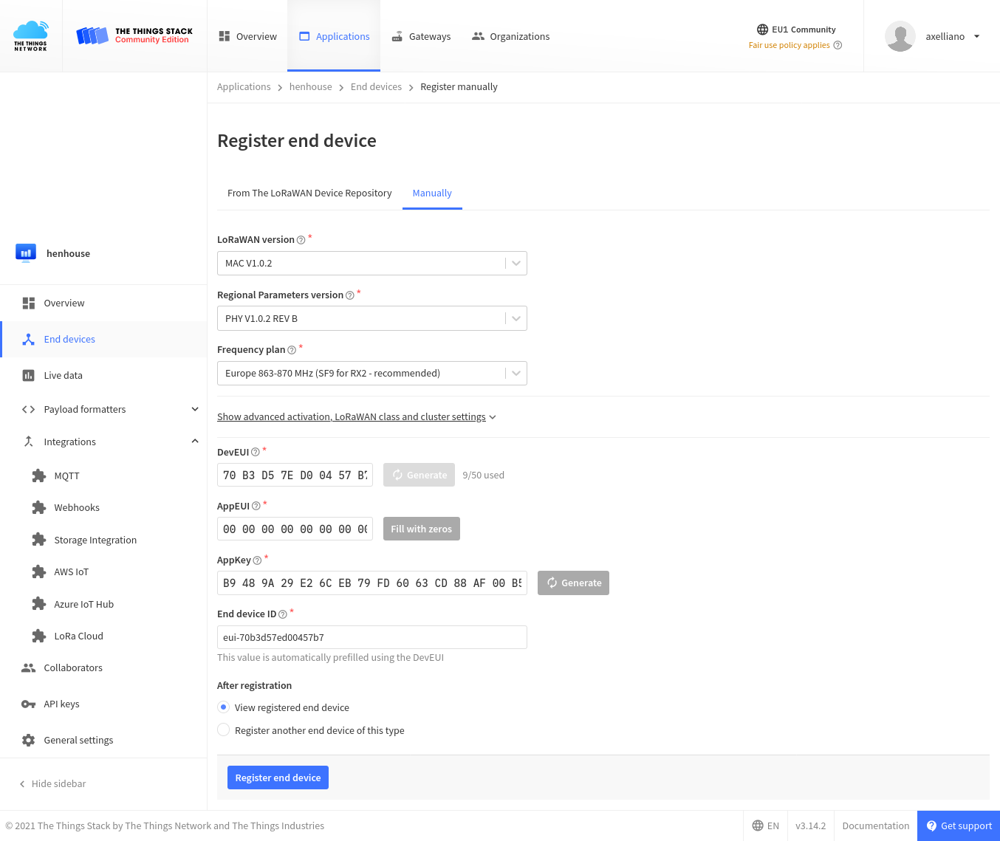
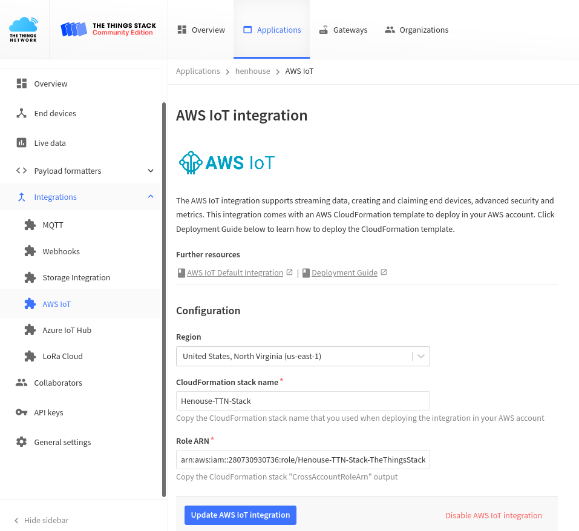
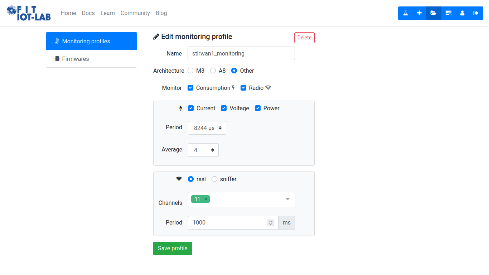

# IoT Third individual assignment
The goal of this assignment is the deployment of a long-range low-power wide area network, made up of multiple MCUs ([ST B-L072Z-LRWAN1](https://www.st.com/en/evaluation-tools/b-l072z-lrwan1.html)), by using [LoRaWAN](https://lora-alliance.org/about-lorawan/) and [TheThingsNetwork](https://www.thethingsnetwork.org/) technologies. Simultaneously, like in previous assignments, performance of the whole system are evaluated. 
This time resulting system incorporates both the [first](./../FirstAssignment) and [second](./../SecondAssignment) individual assignment functionalities, this means newer system is able to receive sensor values from:
1. **Local** STM32 Nucleo F401RE, 
2. **Remote** [802.15.4](https://en.wikipedia.org/wiki/IEEE_802.15.4) + [6LoWPAN](https://en.wikipedia.org/wiki/6LoWPAN) wireless mesh network at [FIT Iot-LAB](www.iot-lab.info)
3. **Remote** [LoRaWAN](https://lora-alliance.org/about-lorawan/) network at [FIT Iot-LAB](www.iot-lab.info)

Focus of the third assignment is the implementation of [IoT Edge Analytics](https://www.sisense.com/glossary/edge-analytics/)
  * For further information, please refer to http://ichatz.me/Site/InternetOfThings2021-Assignment3

## Premise
The long-range low-power wide area network is implemented inside the [Saclay deployment](https://www.iot-lab.info/docs/deployment/saclay/) by FIT IoT-LAB for the following reasons:
1. As stated in the [first assigment](https://github.com/Salvo-32/IoT-IndividualAssignments/tree/main/FirstAssignment#sensors), temputerature sensor and light sensor are needed. Since [ST B-L072Z-LRWAN1](https://www.st.com/en/evaluation-tools/b-l072z-lrwan1.html) board does not provide any kind of sensor (LoRa & SigFox communication module only), it needs a further expansion board (shield) on top it. The only site providing such an assembled configuration is Saclay site, in fact here [ST B-L072Z-LRWAN1](https://www.iot-lab.info/docs/boards/st-b-l072z-lrwan1/) boards (st-lrwan1-1 to st-lrwan1-25) are equipped with the [ST X-NUCLEO-IKS01A2](https://www.st.com/en/ecosystems/x-nucleo-iks01a2.html) shield. This gives access to external sensors to the node, in particular to a temperature sensor HTS221.
2. Despite use of the expansion board above, [ST B-L072Z-LRWAN1](https://www.st.com/en/evaluation-tools/b-l072z-lrwan1.html) board is unable to sense light from the environment, therefore a light sensor is simulated through its firmware (look at [main.c](./Firmware/Endpoint/main.c))
 
The following points present new structure/diagram of the IoT system and its performance:

## How is the long-range low-power wide area network going to affect the IoT platform?
### Deployment of multiple sensors: Benefit
Deploying multiple [ST B-L072Z-LRWAN1](https://www.st.com/en/evaluation-tools/b-l072z-lrwan1.html) boards, each one providing the **same** sensors (real temperature and simulated light) as the ones of the first individual assignment, surely implies a bigger amount of data available to be handled. This aspect leads several advantages and disadvantages
1. Data quality 
   1. Temperature and light are [scalar physical quantities](https://en.wikipedia.org/wiki/Scalar_(physics)) (punctiform) therefore they change according to environmental position, namely with respect to the point in which the sensor performs measurement. 
   2. In particular employing 10 different sensors (5  for temperature and 5 for light, belonging to **different boards**) spread all over the building surface on Saclay site, allow to get values from different points of the environment. (Conversely the architecture of the [first assigment](https://github.com/Salvo-32/IoT-IndividualAssignments/tree/main/FirstAssignment) provides values from a single point only)
   3. Such a new architecture allows to carry out average temperature and brightness of whole environment (not only physical quantity from a limited portion of the environment as before) 
   4. In this way, it is possible to get more accurate values for both quantities that are very close to the real values
2. Fault tolerance
   1. Exploiting different boards, each one with its set of sensors, grants continuity and availability of temperature and light values even if a set of sensors/boards stops working or carries out abnormal data due to malfunctioning. 
   2. For example, right now (2021-09-12 17:35) on Saclay site ```st-lrwan1-8.saclay``` board is **unavailable/suspected**, as you can see from the picture below. If the IoT system relies only on that specific device then no data will be carried out, the web-dashboard will result always empty and the whole system will be useless.   
   3. Moreover the possibility to perform aggregated computations for a specific physical property, through data coming from different positions at the same time, protects against wrong measurement values.
      * In other words if you can trust the majority of the sensor values then even if there are few abnormal values, the outcome is still a reliable one (arithmetic mean).
3. Energy efficiency
   1. Given that LoRaWAN network is a star network, each endpoint has same role and so energy consumption are pretty similar (conversely in previous assignment there are Boarder ROuter nodes and Endpoints node having different role and energy consumption)
   2. Since LPWAN (LNS) server employs adaptive transmission schema for each endpoint device and manages RF output of each one, then it improves/extends life of endpoint batteries

### Limitations of a LoRa network
LoRaWAN network is a narrow-band wireless network, namely available bandwidth (125 kHz) is smaller than conventional wireless network like 802.11 or 2G/3G/4G/5G network. A small bandwidth implies the following unavoidable limitations:
1. Packet size & Bitrate
   1. LoRa allows for packets of 256 bytes max., i.e. very small-sized packet with respect to the ones of previous 802.15.4 network. 
   2. Therefore, MQTT protocol is no more available directly over LoRa for end-point devices beacuse it can works with MB-sized packets. Consequently such a protocol should be implemented over the gateway (base station): whenever it receives small-sized packet from endpoints, extract its payload, build MQTT packet and sends over MQTT. (Indirect use of MQTT)
   3. LoRa allows for different bitrate, in accordance with the [Spreading Factor - SF](https://www.thethingsnetwork.org/docs/lorawan/spreading-factors/) employed. In this project SF is  9 and so **max bitrate** is equal 1758 bps are allowed 
3. End-to-end delay
   1. As stated before, endpoints relies on base station/gateway before thier information reach back-end or whatever high-lvel service. This means end-to-end delay, i.e. time from IoT board to back-end grows due to packet conversion from LoRa packet to IP packet. Using a SF9 (Spreading factor of 9) implies a Time-on-Air of 205 ms for a 10 byte-sized packet, namely time needed to reach the gateway only, moreover delay of IP network must be added.
4. LoRa Gateway: downlink & uplink communication 
   1. LoRa gateway is a packet forwarer, placed between endpoints and LoRaWAN networks server (LNS) that is in charge of managing uplinks and downlinks:
      * It receives LoRa packets from endpoint boards, converts to IP packets and them over a secure IP link to LoRaWAN network server (LNS)
      * It receives IP packets from LNS , converts them to LoRa packets and send them to intended endpoint boards 
   2. Given its fundamental intermediary role, if it fails then there is no communication between both networks
5. Security
   1. Because of the need for intermediate nodes to forward packet toward its intended destination, every packet is vulnerable with respect to its intermediaries
   2. Indeed these nodes could perform whatever function/computation in the packet, altering its content, replacing it entirely, or deviating it from the intended destination. 
   3. In order to avoid wrong behaviors as much as possible, LoRa makes use of secure IP link and AES 128-bit algorithm 

### Data aggregation operations
Within such a constrained network Data Aggregation is needed, for example embedding of values from different sensors in a single pakcet. Thanks to Data Aggregation, number of LoRa packets decreases therefore less current peaks (less Energy consumption), but at the same time latency increases because packets are bigger (always within 256 bytes packet) than the packets containing single sensor type values

### Comparison of data quality (min, max, avg) at Cloud level vs. Edge level

   Operation | **Cloud level** | **Edge level**
   --------- | ----------- | ----------
   **Energy cost** | Negligible, because of unlimited power resource | Too costly, battery-powered device should avoid heavy processing 
   **Processing time** | Fast, because high computational power (Dedicated CPU)| Slow, because of low  computational power (MCU)
   **Processing cost** | Depending on billing model, "pay per use”, “lease it”, “pay for it” | Free of charge

## What are the connected components, the protocol to connect them and the overall IoT architecture?
### Network diagram (Physical devices and Protocols)
The following diagram depicts all the physical devices employed in this assignment and relative network protocols used to interconnect each other


**NOTE** Previous First and Second individual assignments' network components are neither depicted again in the diagram above nor these are taken into account in the description below. (Look at the appropriate [First README](/FirstAssignment/README.md/####-Network-diagram-(Physical-devices-and-Protocols)), [Second README](/SecondAssignment/README.md/###-Network-diagram-(Physical-devices-and-Protocols)))

From LEFT to RIGHT:
1. [ST B-L072Z-LRWAN1](https://www.iot-lab.info/docs/boards/st-b-l072z-lrwan1/) boards (st-lrwan1-1 to st-lrwan1-25) that acts as enpoints.  
   1. They sense temperature and light as in the previous assignment with same sampling rate, but using the integrated sensors ***HTS221*** and as stated inside Premise section above simulated light sensor.
   2. They exploit CMWX1ZZABZ-091 LoRa ® /Sigfox™ module by Murata, to exchange data over European LoRa frequency at 860 MHz
2. [Saclay LoRa gateway](https://www.thethingsnetwork.org/docs/gateways/), namely a device that acts as bridge between endpoint devices and LoRa Network Server of The Things Network. Devices use low power networks like LoRaWAN to connect to the Gateway, while the Gateway uses high bandwidth networks like WiFi, Ethernet or Cellular to connect to The Things Network. It is already configured by FIT IoT-Lab (In case of private gateway you have to configure it properly, please visit https://www.iot-lab.info/legacy/tutorials/riot-ttn/index.html)
3. [LoRaWAN Network Server LNS](https://www.thethingsindustries.com/docs/gateways/lora-basics-station/lns/) is a device that establishes a data connection between a LoRa Gateway and The Things Stack. Moreover it allows MQTT integration, i.e. acts as MQTT/AWS MQTT transpartent bridge. This means data reach AWS web-server using MQTT protocol over TCP/IP network, as in the previous assignment
4. [Amazon AWS MQTT broker](https://aws.amazon.com/), same as previous assignment, which exchange MQTT(TLS) messages with the above-mentioned LNS
5. Frontend devices and (Web-server) Web-dashboard that exchange requests and responses using HTTPS, same as previous assignment
 
In order to clearly understand how the physical devices and software components work together look at paragraph below

### Overall high-level architecture diagram of Software components
This section shows inter-dependencies among the different software components. While the same paragraph of the first assignment provides a detailed description of each single software, here only new components are described 

1. A new RIOT firmware ```LoraHenhouse.elf``` provided [here main.c](./Firmware/Endpoint/main.c) for [ST B-L072Z-LRWAN1](https://www.iot-lab.info/docs/boards/st-b-l072z-lrwan1/) boards which allows them to act as end-points. Several lines of code are comment ones which describe the behavior of the whole firmware, please look at it before you go on. 
   * Conversely, the local Nucleo F401RE board of the previous assignment still run the same firmware, sensing local environment and publishing MQTT messages just like before. 
   * **NOTE** Since each board require different set of unique keys, firmware must be compiled one for each device. 
   * E.g. ```salvo@ubuntu: make DEVEUI=70B3D5ZID0045254 APPEUI=0000000000000000 APPKEY=F152FCCD151F4DE8CD0EC6635EB3BD81```
   * Despite this small annotation, all the firmwares are identically the same
3. As stated at [official TTN documentation](https://www.thethingsnetwork.org/docs/gateways/) Gateway may run on a:
   1. Mminimal firmware, making them low-cost and easy to use, running only the packet forwarding software.
   2. Operating system, for which the packet forwarding software is run as a background program (e.g. Kerlink IoT Station, Multitech Conduit). This gives more liberty to the gateway administrator to manage their gateway and to install their own software
   Unfortunately, FIT IoT-LAB dos not provide any documentation about how the gateway is implemented
4. The Things Stack (LNS implementation) which allows to manage and monitor devices and gateways with an extensive toolset (e.g. AWS integration) while routing data securely to the application. In particular it offers:
   1. Tool to register a new application, like Henhouse. You have to follow the [Adding Applications - TTN Offical docs](https://www.thethingsindustries.com/docs/integrations/adding-applications/), the one employed in this assignment 
       
   2. Tool to add devices to your application. You have to follow the [Adding devices - TTN Offcial docs](https://www.thethingsindustries.com/docs/devices/adding-devices/) 
      
   3. It offers dedicated tool for TheThingNetwork - Amazon AWS IoT Core integration. You have to follow the [Deployment Guide - TTN Offcial docs](https://www.thethingsindustries.com/docs/integrations/cloud-integrations/aws-iot/default/deployment-guide/) 
      
   4. At the end, TTN application dashboard should look like the one below: 
6. AWS Webservices
   1. AWS IoT Core adds automatically one thing per ache registrated devices in TTN Application dashboarda new Thing ```FITIoT-Lab```, which grants access to AWS IoT Core webservices using a new dedicated set of keys and certificates. 
      * To allow the local nucleo board and m3 boards access AWS IoT core at the same time, two different set of keys and certificates are rquired (One for each Thing)
      * Although current repository provides keys and certificates to access my Amazon AWS account at [Firmware/MqttBrokerBridge](./Firmware/MqttBrokerBridge) folder, these are currently not allowed from my personal account. If you want to try the whole system functioning, please contact me at ***Salvo.f96@gmail.com*** 
      
      * IoT Rules (Temperature and Light rule) are the same as before
   4. AWS DynamoDB the same as before
   5. AWS S3 hosts a new version of web-dashboard ```index3.html```, more additional details about its source code are provided below 
5.  Web-dashboard, same structure and technologies of the previous edition but it was enriched with new boards ST B-L072Z-LRWAN1
     

## How do you measure the performance of the system
Each of the following points measure the performance of the whole IoT system in term of Energy efficiency (Power/Current/Voltage monitoring) and Wireless channel analysis, as the number of wireless node increase and consequently their physical locations vary. 
1. Power monitoring follows the official [Consumption monitoring guidelines](https://www.iot-lab.info/docs/tools/consumption-monitoring/) by FIT IoT-LAB, , please look at it to set up monitoring activity 

2. Here there is the list used to set up profiles above  (they take place at fava@saclay):
   1. ```iotlab-profile addother -n stlrwan1_monitoring --power dc -voltage -current -power -period 8244 -avg 4 -rssi -channels 22 26 -num 1 -rperiod 1000```
   2. ```iotlab-node --profile stlrwan1_monitoring -l saclay,st-lrwan1,1-5```
3. Textual results are available at [Evaluation folder](./Evaluation) of this repository, and they include raw analysis files for each endpoint.
4. Next sections carry out graphical outcomes about the monitoring activities, for each node. 

### Experiment 277056 - 5 wireless nodes 
The IoT-LAB experiment 272564 takes place in Saclay site, involving:
* **5** endpoint nodes ```sm3-2.saclay```, ```m3-4.saclay``` **-** ```m3-7.saclay``` 
* 1 border router ```m3-1.saclay```
* 1 MQTT bridge ```a8-2.saclay```

To show the following result, the following shell command are used:
1. ```iotlab-experiment submit -n Henhouse -d 120 -l saclay,a8,2 -l saclay,m3,1+2+4-7```
2. ```iotlab-node --profile A8PowerMonitoring1 -l saclay,a8,2```
3. ```iotlab-node --profile M3Monitoring1 -l saclay,m3,1+2+4-7```
4. ```plot_oml_consum --input ~/.iot-lab/272563/consumption/a8_2.oml --power --label "A8-2 - Power consumption analysis - Exp ID 272563"``` 
5. ```plot_oml_consum --input ~/.iot-lab/272563/consumption/m3_1.oml --power --label "Border router (m3-1) - Power consumption analysis - Exp ID 272563"``` 
6. ```plot_oml_radio --input ~/.iot-lab/272563/radio/m3_1.oml --label "Border router (m3-1) - Wireless channel analysis - Exp ID 272563" --all``` 
7. ```plot_oml_consum --input ~/.iot-lab/272563/consumption/m3_2.oml --power --label "Endpoint (m3-2) - Power consumption analysis - Exp ID 272563"``` 
8. ```plot_oml_consum --input ~/.iot-lab/272563/consumption/m3_4.oml --power --label "Endpoint (m3-4) - Power consumption analysis - Exp ID 272563"``` 
9. ```plot_oml_consum --input ~/.iot-lab/272563/consumption/m3_5.oml --power --label "Endpoint (m3-5) - Power consumption analysis - Exp ID 272563"```
10. ```plot_oml_consum --input ~/.iot-lab/272563/consumption/m3_6.oml --power --label "Endpoint (m3-6) - Power consumption analysis - Exp ID 272563"```
11. ```plot_oml_consum --input ~/.iot-lab/272563/consumption/m3_7.oml --power --label "Endpoint (m3-7) - Power consumption analysis - Exp ID 272563"```

## Conclusion & Results
1. As you can infer from the graphs above as the number of wireless nodes increases ```m3-1.saclay``` border router's power consumption increases. In particular, its first power consumption graph (m3-1.saclay) shows few peaks around 0.12 W with an average value of 0.11 W, conversely the second one shows much more peaks around 0.14 W and an average values of 0.12 W.
2. Since during both experiments there were not running experiments on Saclay site, border router's wireless channel analysis shows an RSSI near -91 dBm without noise. This means transceiver were able to exchange data without external noise in that frequency band (channel 26). Nevertheless depending on the radio environment perturbations, you could measure worse RSSI values with relative noise, that will damage wireless links.
3. As stated in the [Disadvantages of a multi-hop wireless network](./README.md#disadvantages-of-a-multi-hop-wireless-network) above, deploying multiple IoT-LAB M3 boards, surely implies a bigger amount of data available to be handled. It is absolutely clear looking at both the graphs of MQTTS/MQTT broker ```a8-2.saclay```, they show an harder power consumption activity that grows as the number of MQTTS message grows (second experiment)

## Sources
1. https://iot-lab.github.io/docs/boards/st-b-l072z-lrwan1/
2. https://www.st.com/en/ecosystems/x-nucleo-iks01a2.html - Sensor Exapansion Board for STM32 Boards
3. https://doc.riot-os.org/group__sys__random.html - For random number generation
